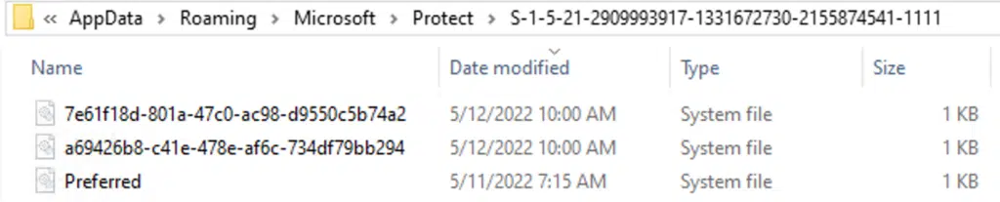

## Table Of Contents
* [Introduction](#introduction)
* [What kind of encrypted secrets (DPAPI blobs) are protected by DPAPI?](#what-kind-of-encrypted-secrets-dpapi-blobs-are-protected-by-dpapi)
* [How are these encrypted (e.g. which keys are used) and where are they stored?](#how-are-these-encrypted-eg-which-keys-are-used-and-where-are-they-stored)
  * [Encryption Mechanism](#encryption-mechanism)
  * [Master Keys](#master-keys)
  * [Master key structure (Windows XP and above)](#master-key-structure-windows-xp-and-above)
  * [Storage locations](#storage-locations)
  * [The preferred file](#the-preferred-file)
  * [DPAPI domain backup key](#dpapi-domain-backup-key)
* [Is there a way to extract the values of those secrets? What tools can we use (focusing on Linux-based solutions)?](#is-there-a-way-to-extract-the-values-of-those-secrets-what-tools-can-we-use-focusing-on-linux-based-solutions)
  * [Key Hierarchy and Decryption Flow](#key-hierarchy-and-decryption-flow)
  * [RSA Machine (Private) Key decryption using impacket & SharpDPAPI](#rsa-machine-private-key-decryption-using-impacket--sharpdpapi)
  * [Chrome stored passwords decryption](#chrome-stored-passwords-decryption)

## Introduction
DPAPI (Data Protection API) is an integral component within the Windows OS designed to provide a simple, yet secure method of **encrypting** and **decrypting** data. This API is used by both system and third-party applications to protect sensitive information such as **passwords**, **certificates**, and other **confidential data**. This simplifies the process for developers, who don't need to manage the protection of the encryption keys themselves. The encryption keys used by DPAPI are either tied to specific users or the local system, ensuring that the protected data remains secure and accessible only to authorized entities.


## What kind of encrypted secrets (DPAPI blobs) are protected by DPAPI?
* **Web Browsers**: Cookies, usernames, passwords and auto-completion data stored by Chromium-based browsers like Chrome & Edge.
* **Email Clients**: Passwords and account information for email applications such as Outlook and Windows Mail.
* **Windows Credential Manager**: Passwords for shared folders, internal FTP accounts, network resources and other credentials stored in the Windows Credential Manager.
* **Network Passwords**: Wi-Fi passwords (both WEP/WPA and Enterprise PEAP versions).
* **System Credentials**: Credentials for Windows Vault, remote desktop connections (RDP), and other system-level secrets.
* **Third-Party Applications**: Passwords and credentials for applications like OpenVPN, iCloud, VMware Workstation, FortiClient, and Dropbox.
* **Private Keys**: Asymmetric private keys, certificates, and other encryption keys used by various applications.
* **Windows Hello**: Credentials used for Windows Hello (e.g., PIN, picture password, fingerprint).
* **Other Applications**: Personal data in applications like Skype, MSN Messenger, and more.

## How are these encrypted (e.g. which keys are used) and where are they stored?

### Encryption Mechanism
When an application calls DPAPI to protect data, the following process occurs:

#### Key Derivation
* DPAPI generates a unique symmetric key for each piece of data to be encrypted.
* This key is derived using PBKDF2.
* The inputs to PBKDF2 include:
  * The user's password (for user data) or system secret (for system data)
  * A randomly generated salt (typically 16 bytes)
  * An iteration count (varies by Windows version, e.g., 8000 for Windows 10)

#### Data Encryption


* The derived symmetric key is used to encrypt the data.
* The encryption algorithm depends on the Windows version.
| OS           | Ciphering algorithm | Hashing algorithm | PBKDF2 iterations |
|--------------|--------------------|--------------------|-------------------|
| Windows 7    | AES256            | SHA512            | 5600              |
| Windows 10   | AES256            | SHA512            | 8000              |
| Windows 2000 | RC4               | SHA1              | 1                 |
| Windows Vista| 3DES              | SHA1              | 24000             |
| Windows XP   | 3DES              | SHA1              | 4000              |

#### DPAPI Blob Creation

DPAPI has two parts: the encryption/decryption keys, called DPAPI Master Keys and the encrypted data itself, called a DPAPI Blob or just blob. The blob is actually a binary, hex-formatted data structure with several fields.

**Encrypted data blob structure** with the most important values highlighted:


* **guidMasterKey** – A [GUID (globally unique identifier)](https://learn.microsoft.com/en-us/dotnet/api/system.guid?view=net-6.0) representing the identifier of the **Master Key** that was used to encrypt this blob. This can be either a user’s Master Key or a local machine Master Key (see details below).
* **pbSalt** – A salt value that was generated during the encryption operation. This salt is coupled with the Master Key to encrypt the plaintext data.
* **pbData** – The actual encrypted data. As shown above, the blob structure contains a list of algorithms, format, and additional information related to how the data was encrypted.

### Master Keys

Each authority (details below) in a Windows operating system (OS) has its own DPAPI Master Key, which is used by any application running in the related authority context. The Master Key is stored to a file and encrypted at rest using one method or two methods – depending on the authority being used, and the Windows version.

There are two types of master keys:

* **User Master Keys**: Unique to each user, derived from the user's password and:
  * For **domain** users: combination of user's SID and [NTLM hash](https://www.tarlogic.com/cybersecurity-glossary/ntlm-hash/)
  * For **local** users: combination of user's SID and SHA1 hash of the password
  * Notes:
    * DPAPI User Master Keys **cannot be decrypted offline** unless the password or SHA1 hash of that password is known.
    * On a running system, after typing in the password during login: the SHA1 password hash is being kept in the memory of the process “lsass.exe”, and that is what e.g., PowerShell uses to encrypt and decrypt User DPAPI Blobs.
* **System Master Keys**: Unique to each system, used for encrypting data accessible to all users on the system. These are encrypted with the Local Security Authority (LSA) DPAPI secret key.

### Master key structure (Windows XP and above)

#### Headers

* **Version**: The Master Key version, commonly has a value of 2
* **GUID**: Master Key’s identifier
* **Flags**: Includes settings of the Master Key. For example, one of the flags indicates whether Section 1: User-encrypted Master Key (see details below) is encrypted with the SHA1 or the NTLM hash of the user’s password.
* **Sections lengths**: Specifies the length of each section. Lengths can help to determine which sections are used to encrypt this Master Key.

#### Body (Sections)

Sections contain the actual Master Key (the one that is used to encrypt and decrypt data blobs) in an encrypted form.

* **Section 1: User-encrypted Master Key**: Stores the Master Key in a user-encrypted form, where the phrase used to encrypt it is the user’s password or DPAPI_SYSTEM registry key (depending on the authority).
* **Section 2: Local Encryption Key (legacy)**: This legacy section, used in Windows 2000, stores a local encryption key to decrypt a local backup of the Master Key. This section is not used from later Windows versions but still contains data.
* **Section 3: Credential History**: Stores a GUID that points to a link stored in the user’s [CREDHIST](https://www.passcape.com/windows_password_recovery_dpapi_credhist) file. The CREDHIST (Credential History) file maintains a chain of a local user password history, in an encrypted form. As local users may change their passwords, DPAPI requires the ability to read the password that was used to encrypt a Master Key created in the past.
* **Section 4: Domain Backup**: Stores another Master Key copy that was encrypted with the domain backup key. **The domain backup key** is an RSA key pair in which the private and public keys are stored in the Domain Controller (DC), and the public key is also distributed to every user’s profile, enabling each user to encrypt their own Master Key. This does not back up a copy of the Master Key to the DC, but provides the ability to recover it if the domain user’s password is forgotten. As there might be more than one domain backup key, this section includes a slot for the GUID of this key.

### Storage locations
* **DPAPI blobs** (encrypted secrets) are typically stored in:
  * `C:\Users\<USER>\AppData\Local\Microsoft\Credentials\`
  * `C:\Users\<USER>\AppData\Roaming\Microsoft\Credentials\`
  * Application-specific locations (e.g., Chrome user data directory)
* **User Client Certificates**
  * Public Key Certificates: `%AppData%\Microsoft\SystemCertificates\My\Certificates\`
  * Private Keys: `C:\Users\<USER>\AppData\Roaming\Microsoft\Crypto\RSA\<USER_SID>\`
* **System Client Certificates**
  * Public Key Certificates: `HKEY_LOCAL_MACHINE\SOFTWARE\Microsoft\SystemCertificates`
  * Private Keys: `<DISK>\ProgramData\Microsoft\Crypto\RSA\MachineKeys\`
* **Master Keys** (used by **4** different authorities):
  1. **Local Machine (System Master Keys)**
     * Master Key location: `C:\Windows\System32\Microsoft\Protect\S-1-5-18\`
     * Additional information: This Master Key is used when the application scopes the data encryption to use the local machine. The `CRYPTPROTECT_LOCAL_MACHINE` flag is set.
  2. **Local Users**
     * Master Key location: `C:\Users\<USER>\AppData\Roaming\Microsoft\Protect\<USER_SID>`
     * Additional information: Older Master Keys of local users point to the relevant link within the **CREDHIST** file, as the key might be encrypted with an older password.
  3. **System Users**
     * Master Key location: `C:\Windows\System32\Microsoft\Protect\S-1-5-18\<USER>`
     * Common data blobs paths:
       * `C:\Windows\System32\config\systemprofile\AppData\`
       * `C:\Windows\System32\config\LocalService\AppData\`
       * `C:\Windows\System32\config\NetworkService\AppData\`
     * Additional information: This Master Key is used when the encryption is scoped to the user, but the process is running with either System, LocalService or NetworkService users.
  4. **Domain Users**
     * Master Key location: `C:\Users\<USER>\AppData\Microsoft\Protect\<USER_SID>`
     * Additional information: Unlike local users, all domain users’ Master Keys are always encrypted with their **latest** password, because domain users **do not** maintain a CREDHIST file.

### The preferred file

Inside Master Key’s path, we may encounter more than one Master Key file. This is because Master Keys are set to expire approximately 90 days after creation. DPAPI uses the ‘Preferred’ file, located in the same folder, to keep track of the currently used (preferred) Master Key and its expiration date.

The image below shows an example of the files that may be located in a domain user’s Master Key path:


### DPAPI domain backup key
The DPAPI Domain Backup key is a unique RSA key pair that is generated only once, when the domain is created.

The backup key is stored in the Active Directory as an [LSA secret object](https://learn.microsoft.com/en-us/openspecs/windows_protocols/ms-adsc/4ebb9507-6460-4d3c-a9f9-e21608708598), and is replicated across all Domain Controllers in the same domain. Members of the Domain Administrators group have the required privileges to read this key, and tools like [Mimikatz](https://github.com/gentilkiwi/mimikatz) and [SharpDPAPI](https://github.com/GhostPack/SharpDPAPI) can aid in automating the dump process and conversion of the key to a [PVK format](https://web.archive.org/web/20170531040754/http:/www.drh-consultancy.demon.co.uk/pvk.html). The PVK can be later used to decrypt a Master Key of any user in the domain.

As previously mentioned, it's stored within the Active Directory database therefore doesn't have a traditional file system path. We can locate it through the `DSA.msc` (Directory Services Administrative) tool, under the '**System**' container:


## Is there a way to extract the values of those secrets? What tools can we use (focusing on Linux-based solutions)?

### Key Hierarchy and Decryption Flow
1. **BootKey (SysKey)**
   * A 128-bit (16-byte) value derived from the SYSTEM registry hive is unique to each Windows system.
   * Used to decrypt the LSA secrets stored in the SECURITY hive.
   * The BootKey is derived from several values in the SYSTEM hive, such as `HKEY_LOCAL_MACHINE\SYSTEM\CurrentControlSet\Control\Lsa\` values, combined and hashed to form the BootKey.
2. **LSA Key**
   * Stored in the SECURITY hive, encrypted with the BootKey.
   * Used to decrypt specific LSA secrets, including DPAPI system-related secrets.
   * Once the BootKey is obtained, it decrypts the LSA key.
3. **LSA Secrets**
   * Encrypted with the LSA Key and stored in the SECURITY hive (SECURITY\Policy\Secrets).
   * The following secrets can be found, among others:
     * `DPAPI_SYSTEM` which contains the DPAPI machine and user key for local DPAPI.
     * `NL$KM` which contains an encryption key for the MsCache also stored in the SECURITY hive (SECURITY\Cache). MsCache are the latest hashed credentials for domain users.
     * `$MACHINE.ACC` contains the computer account credentials when joined to an Active Directory domain.
     * `DEFAULTPASSWORD` is the default password when the auto-logon feature is configured.
     * Keys starting with `_SC_` corresponds to non-interactive service account credentials that could be local or for a domain user.
   * Decrypted using the LSA Key.
4. **DPAPI_SYSTEM Secret**
   * One of the LSA secrets, specifically used for DPAPI operations.
   * Contains the master key necessary to decrypt system-wide DPAPI master keys.
   * Decrypted using the LSA Key.
5. **System Master Keys**
   * Stored under `<DISK>\Windows\System32\Microsoft\Protect\S-1-5-18\`
   * Each master key has a GUID and is encrypted using the DPAPI_SYSTEM secret.
   * Decrypted using the DPAPI_SYSTEM secret.
6. **RSA Machine (Private) Keys**
   * Located in `<DISK>\ProgramData\Microsoft\Crypto\RSA\MachineKeys\`
   * Used by the Cryptographic API (CAPI) to encrypt and decrypt **System Client Certificates**.
   * Decrypted using a specific **System Master Key** from the available ones.
7. **Crypto Keys (CNG)**
   * Found in `<DISK>\ProgramData\Microsoft\Crypto\Keys\`
   * Used by Cryptography API: Next Generation (CNG) for cryptographic operations.
   * Decrypted using a specific **System Master Key**.
8. **User Data (e.g., DPAPI-protected blobs, certificates)**
   * Finally, the decrypted **System Master Keys** or the **RSA Machine/Private Keys** can be used to decrypt DPAPI-protected data such as user credentials, certificates, or other sensitive information.

### RSA Machine (Private) Key decryption using impacket & SharpDPAPI
1. Extract SYSTEM and SECURITY Registry Hives
   * `cp <DISK>/Windows/System32/config/SYSTEM <WORKING_DIR>/DPAPI_SYSTEM.hive`
   * `cp <DISK>/Windows/System32/config/SECURITY <WORKING_DIR>/DPAPI_SECURITY.hive`
2. Extract System Master Keys
   * `cp -r <DISK>/Windows/System32/Microsoft/Protect/S-1-5-18/ <WORKING_DIR>/SYSTEM_MKs_S-1-5-18`
3. Decrypt each System Master Key using impacket’s `dpapi.py` and the above Registry hives
   *  `python3 impacket/dpapi.py masterkey -file SYSTEM_MKs_S-1-5-18/<SYSTEM_MK_GUID> -system DPAPI_SYSTEM.hive -security DPAPI_SECURITY.hive`
   *  Indicative output:
```
$ dpapi.py masterkey 
   -file SYSTEM_MKs_S-1-5-18/e68e86c9-c3c3-4958-b923-7b2977
   -system DPAPI_SYSTEM.hive 
   -security DPAPI_SECURITY.hive
   
Impacket v0.11.0 - Copyright 2023 Fortra
[MASTERKEYFILE]
Version     :        2 (2)
Guid        : e68e86c9-c3c3-4958-b923-7b2977
Flags       :        6 (6)
Policy      :        0 (0)
MasterKeyLen: 000000b0 (176)
BackupKeyLen: 00000090 (144)
CredHistLen : 00000014 (20)
DomainKeyLen: 00000000 (0)

[*] Target system bootKey: 0x283901db1a53ff37fd9b1a7d10
[*] Dumping LSA Secrets
[*] $MACHINE.ACC
[*] DefaultPassword
[*] DPAPI_SYSTEM
[*] NL$KM
Decrypted key with MachineKey
Decrypted key: 0xf65237cada605ce19326184cafe30973f47d0fd7d8f37a0a53d8
   ```
4. Get the SHA1 hash of the Decrypted System Master Key
   * `echo -n "<decrypted_system_mk>" | xxd -r -p | sha1sum`
   * Example: `echo -n "f65237cada605ce19326184cafe30973f47d0fd7d8f37a0a53d8" | xxd -r -p | sha1sum`
5. Extract the Private Keys you want to decrypt
   * Cryptographic API (**CAPI**)
     * Extract RSA Machine keys
       * `cp -r <DISK>/ProgramData/Microsoft/Crypto/RSA/MachineKeys/. <WORKING_DIR>/RSA_MACHINE_KEYS/`
   * Cryptography API: Next Generation (**CNG**)
     * Extract Crypto/Keys
       * `cp -r <DISK>/ProgramData/Microsoft/Crypto/Keys/. <WORKING_DIR>/CRYPTO_KEYS/`
6. Install wine in order to run SharpDPAPI (compiled binary [here](https://github.com/r3motecontrol/Ghostpack-CompiledBinaries))
   * ```
      $ apt install wine
      $ dpkg --add-architecture i386
      $ apt install wine32
      $ wine msiexec /i wine-mono-[version].msi
      ```
7. Run SharpDPAPI.exe with **certificates** action and only the target file as input
   * `wine SharpDPAPI.exe certificates /target:<RSA_MACHINE_KEY> `
   * Example below, notice the `masterkey needed: {<SYSTEM_MASTERKEY_GUID>}` output
   * ```
      $ wine SharpDPAPI.exe certificates /target:a1006ebd40f83685cc94962e0dd973d9_62526833-1703-428f-84dd
      
      0009:err:mscoree:LoadLibraryShim error reading registry key for installroot
      __                 _   _       _ ___
      (_  |_   _. ._ ._  | \ |_) /\  |_) |
      __) | | (_| |  |_) |_/ |  /--\ |  _|_
                     |
      v1.11.2
      
      [*] Action: Certificate Triage
      [*] Target Certificate File: a1006ebd40f83685cc94962e0dd973d9_62526833-1703-428f-84dd
      
         [!] a1006ebd40f83685cc94962e0dd973d9_62526833-1703-428f-84dd masterkey needed: {e68e86c9-c3c3-4958-b923-7b2977}
      
      [*] Hint: openssl pkcs12 -in cert.pem -keyex -CSP "Microsoft Enhanced Cryptographic Provider v1.0" -export -out cert.pfx
      
      SharpDPAPI completed in 00:00:00.1879740
      ```
8. Run SharpDPAPI.exe with certificates action and the needed System MK from above
   * `wine SharpDPAPI.exe certificates /target:<RSA_MACHINE_KEY> /showall "{<SYSTEM_MK_GUID>}:<DECRYPTED_SYSTEM_MK_SHA1_HASH>"`

### Chrome stored passwords decryption