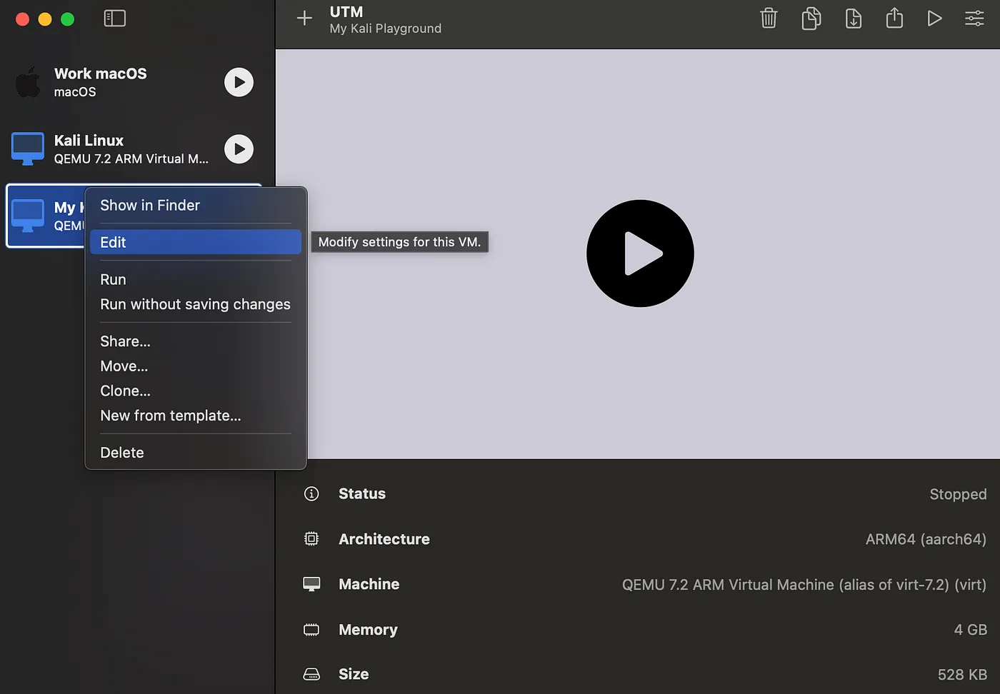

*This guide is based on macOS 14.4, UTM 4.4.6 and Kali Linux 2024.1-arm64.*

---

First Post!


UTM, a macOS-specific virtualization tool, offers cybersecurity enthusiasts a solution for running diverse operating systems like Kali Linux on Apple Silicon MacBooks, filling the gap left by incompatible traditional options such as VirtualBox.

## Step 1: Install UTM
Download the .dmg file from https://mac.getutm.app/ and install it.

## Step 2: Get Kali Linux Installer Image for ARM

Go to https://www.kali.org/get-kali/#kali-installer-images to download the latest official installer image. Make sure to choose “**Apple Silicon (ARM64)”**. You can choose offline or online installer image per your needs, but the offline image is recommended for simplicity.


After downloading, you should have an **`.iso`** file on your disk.

## Step 3: Create A VM Using the Image

***Tips:**  During setup, UTM might ask for system permissions multiple times; please grant them. Most VM settings can be adjusted post-creation, so initial setup needn’t be time-consuming.*

1. Open UTM. Click the **“+”** button to create a new VM. Then select “**Virtualize”**.


2. Select **“Other”**.


3. Click **“Browse”** to select the **`.iso`** file you just downloaded, and then click **“Continue”**.


1. Leave Memory and CPU settings as default. Click **“Continue”**.


2. Decide the disk space for Kali Linux. Kali’s docs recommends ≥ 20GB on the higher end. Then click **“Continue”**.


3. Set up a shared directory path if needed. This allows sharing files between the host and the virtual client. Let’s skip it for now and click **“Continue”.**

***Tips:** To make directory-sharing work, you need to install some software later in the virtual machine guest, which will be mentioned later.*


7. Review the summary, choose a nickname for this VM, and click **“Save”**.


8. Now your should see the new virtual machine on the left.

## Step 4: Boot and Install Kali Linux

***Tips:** The following sub-steps are complex and require **careful attention.***

1. Right click the new VM and select **“Edit”**.



2. Due to a bug on UTM, we need to install Kali in console-only mode. 
Firstly, in the devices list, right click the current Display and select **“Remove”**. Then select **“+ New…”** and add a **“Serial”** device. This will give us a console GUI during the the boot.


Remove the existing “Display” device


Add a new “Serial” device

1. After the **“Serial”** device is added, click **“Save”**.


2. Now run the VM.


5. It should open a console window, where we will proceed with the installation of Kali Linux. Use your keyboard navigate within this window (e.g, arrow keys to move between options and Enter key to select).


6. Select **“Install”**.


7. Follow the instructions to set up language, region, timezone, etc. You can customize your hostname, username, and password as needed. For optional settings like “domain” and “full name”, you can leave them blank.


8. When you reach the **“Partition disks”** step, select **“Guided — use entire disk” → “Virtual disk 1” → “All files in one partition” → “Finish partitioning and write changes to disk” → “Yes”**.


9. In the **“Software Selection”** step, select the default option, **“Xfce”**. The installation of software packages will take approximately 10 minutes to finish. **DO NOT perform any actions after it finishes**; instead, carefully follow the next sub-step.


10. When you reach the **“Finish the Installation”** step, **DO NOT select “Continue”**. Instead, return to UTM’s main window, select your VM on the left, and then scroll down to the bottom on the right side. Select **“CD/DVD”** and click **“Clear”**. This action mimics ejecting the installation drive (the **`.iso`** file), ensuring that the next reboot will load the installed system instead of booting from the installation drive again.


**11. Right click your VM and select “Stop”.**


12. Edit your VM to remove the **“Serial”** device. Then, add a new **“Display”** device, selecting the **“virtio-gpu-pci”** option. Then save the settings and run the machine.


13. Log in using your username and password. Your Kali Linux VM is now up and running! However, a few additional setups are required to further enhance the user experience.

## Step 5: Enable Dynamic Resolution & Clipboard Sharing

- **Dynamic resolution** is a feature that enables the VM’s display resolution to automatically adjust to match the size of the UTM window as it changes.
- **Clipboard sharing** facilitates copying and pasting to and from the VM.

To support these two features, we will need to install a Linux package called **`spice-vdagent`**.

1. Launch the virtual machine (VM) and log into Kali Linux.
2. Open the **“Terminal Emulator”** application.
3. Enter the following commands:

```
sudo apt install spice-vdagent
```

4. Once the installation is complete, restart the VM.

5. **`spice-vdagent`**should now be running as a systemd service in the background. Test the setup by copying and pasting to or from the VM; it should function seamlessly.

6. However, you may encounter issues with dynamic resolution not functioning. Now you can diagnose using below command:

```
sudo systemctl status spice-vdagent
```


If you notice error messages such as **`invalid message size for VDAgentMonitorsConfig`**, this indicates a known bug in UTM. To work around this issue, you can manually trigger a resolution adjustment by executing the following command:
`xrandr --output Virtual-1 --auto`

7. To avoid the hassle of manually running the command every time you change the window size, you can set up a background service to automate the process. Use the below commands, and remember to replace **`YOUR_USER_NAME`** in the script with your actual username:

```bash
# 1. Create a script to watch error messages from spice-vdagentd and execute the fix command
sudo tee /usr/local/bin/auto_adjust_resolution.sh > /dev/null << 'EOF'
#!/bin/bash

journalctl -fu spice-vdagentd | grep --line-buffered "invalid message size" | while read line ; do
    xrandr --output Virtual-1 --auto
done
EOF

# 2. Make the script executable
sudo chmod +x /usr/local/bin/auto_adjust_resolution.sh

# 3. Create a systemd service to keep the script running in the background
sudo tee /etc/systemd/system/auto_adjust_resolution.service > /dev/null << 'EOF'
[Unit]
Description=Monitor spice-vdagentd logs for "invalid message size" and adjust display
After=network.target

[Service]
Type=simple
User=YOUR_USER_NAME
Environment="DISPLAY=:0"
ExecStart=/usr/local/bin/auto_adjust_resolution.sh
Restart=on-failure

[Install]
WantedBy=multi-user.target
EOF

# 4. Register and start the service
sudo systemctl daemon-reload
sudo systemctl enable auto_adjust_resolution.service
sudo systemctl start auto_adjust_resolution.service

# 5. Check if the service is up and running
sudo systemctl status auto_adjust_resolution.service
```

To test the setup, resize the UTM’s VM window. The resolution inside the VM should adjust promptly to match the window size.

## Step 6: Enable Directory Sharing

Directory sharing facilitates the sharing of a directory from the host system with the virtual machine (VM). This functionality depends on the Linux package **`spice-webdavd`**. Follow the steps below to set it up: Open the Terminal in Kali Linux and run the following command to install **`spice-webdavd`**:

```
sudo apt install spice-webdavd
```

2. Stop the VM to access its **“Sharing”** configuration section. Ensure the **“Directory Share Mode”** is set to **“SPICE WebDAV”**. Click **“Browse”** to select the directory on the host system that you wish to share with the VM. And after that, click **“Save”** to apply the changes.


3. Now the URL **`http://localhost:9843`** is pointing to the SPICE WebDAV server running on the VM. You can access the files using a web browser or a WebDAV client within the VM.

## Step 7: Congratulations 🎉