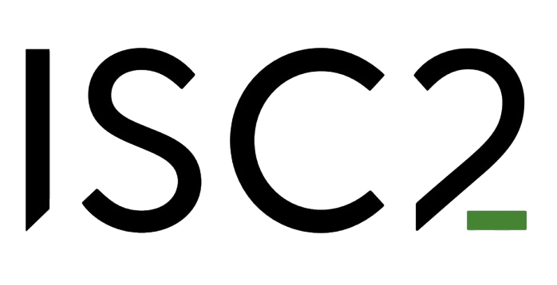

#

Downloadㅤ


## Experience

<table>
    <thead>
        <tr>
            <th>Company</th>
            <th>Link</th>
            <th>Role</th>
            <th>Dates</th>
            <th>Location</th>
        </tr>
    </thead>
    <tbody>
        <tr>
            <td rowspan=3></td>
            <td rowspan=3><a href="https://grnet.gr/en" target="_blank">GRNET / ΕΔΥΤΕ</a></td>
        </tr>
        <tr>
            <td>IT Security Engineer</td>
            <td>2024 - Present</td>
            <td>Remote   Athens, GR</td>
        </tr>
        <tr>
            <td>NOC Support</td>
            <td>2022 - 2024</td>
            <td>Remote   Athens, GR</td>
        </tr>
        <tr>
            <td></td>
            <td><a href="https://en.uoa.gr/" target="_blank">University of Athens</a></td>
            <td>Teaching Assistant @ Data Security & Privacy</td>
            <td>2023 - 2024</td>
            <td>Onsite   Athens, GR</td>
        </tr>
    </tbody>
</table>

---

## Education

<table>
    <thead>
        <tr>
            <th>University</th>
            <th>Link</th>
            <th>Degree</th>
            <th>Dates</th>
        </tr>
    </thead>
    <tbody>
        <tr>
            <td rowspan=3></td>
            <td rowspan=3><a href="https://en.uoa.gr/" target="_blank">University of Athens</a></td>
        </tr>
        <tr>
            <td>MSc, Computer Systems</td>
            <td>2024 - Present</td>
        </tr>
        <tr>
            <td>BSc, Business Administration</td>
            <td>2019-2024</td>
        </tr>
        <tr>
            <td></td>
            <td><a href="https://codingfactory.aueb.gr/" target="_blank">AUEB | Coding Factory</a></td>
            <td>Software Engineering Bootcamp  (8 months)</td>
            <td>2023</td>
        </tr>
    </tbody>
</table>

---

## Certifications
#

Show Credentials


<table>
    <thead>
        <tr>
            <th>Organization</th>
            <th>Link</th>
            <th>Certification</th>
            <th>Date</th>
        </tr>
    </thead>
    <tbody>
        <tr>
            <td></td>
            <td><a href="https://www.isc2.org/" target="_blank">ISC2</a></td>
            <td>CC (Certified in Cybersecurity)</td>
            <td>2024</td>
        </tr>
        <tr>
            <td></td>
            <td><a href="https://www.edx.org/school/delftx" target="_blank">TU Delft</a></td>
            <td>Unix Tools: Data, Software and Production Engineering</td>
            <td>2023</td>
        </tr>
        <tr>
            <td></td>
            <td><a href="https://arcx.io/" target="_blank" >arcX</a></td>
            <td>Cyber Threat Intelligence 101</td>
            <td>2023</td>
        </tr>
        <tr>
            <td></td>
            <td><a href="https://linq.co/" target="_blank" >linq</a></td>
            <td>Cybersecurity - Penetration Testing</td>
            <td>2023</td>
        </tr>
        <tr>
            <td></td>
            <td><a href="https://grow.google/intl/europe/" target="_blank">Google</a></td>
            <td>Web Analytics Advanced</td>
            <td>2023</td>
        </tr>
    </tbody>
</table>